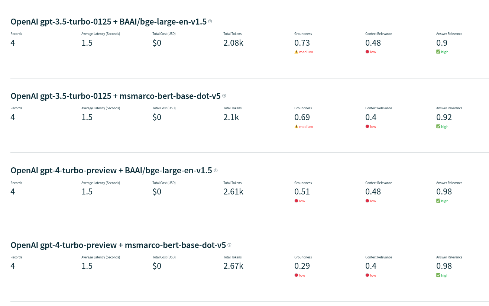

# RAG Performance Comparison 

Retrieval Augmented Generation (RAG) has become a mainstream in the AI world. Due to its importance, we decided to conduct a comparison between some of the most commum RAG configuration.

The aim is to evaluate the performance of some RAG approaches in order to better understand the technology and evolve our RAG applications.

The work is organized in the following way:

1. **Two highly performatic sentence transformer retrievers**
    - msmarco-bert-base-dot-v5: https://huggingface.co/sentence-transformers/msmarco-bert-base-dot-v5
    - BAAI/bge-large-en-v1.5: https://huggingface.co/BAAI/bge-large-en-v1.5
2. **Two state-of-the-art LLM models**
   - gpt-4-turbo-preview
   - gpt-3.5-turbo-0125
3. **All four combinations were tested**
4. **The framework TrueLens (https://www.trulens.org/) was used to measure the performance regarding: Groundedness, Answer and Context Relevance**

The definition of these concepts are:

- Context Relevance: The first step of any RAG application is retrieval; to verify the quality of our retrieval, we want to make sure that each chunk of context is relevant to the input query. This is critical because this context will be used by the LLM to form an answer, so any irrelevant information in the context could be weaved into a hallucination. TruLens enables you to evaluate context relevance by using the structure of the serialized record.

- Groundedness: After the context is retrieved, it is then formed into an answer by an LLM. LLMs are often prone to stray from the facts provided, exaggerating or expanding to a correct-sounding answer. To verify the groundedness of our application, we can separate the response into individual claims and independently search for evidence that supports each within the retrieved context.

- Answer Relevance: Last, our response still needs to helpfully answer the original question. We can verify this by evaluating the relevance of the final response to the user input.

The results are:

